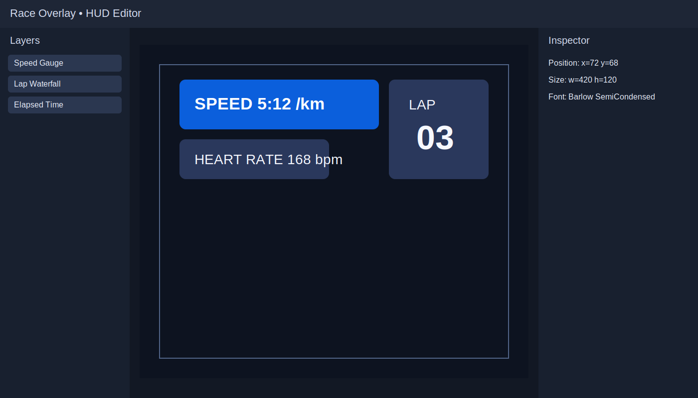

# Race Overlay


Race Overlay is a Python toolchain for turning your activity telemetry into polished running videos with an editable, broadcast-style HUD. It can read activity files, align data with footage, preview overlays in a browser editor, and render final videos with FFmpeg.

## What you can do

- Import activity data from `.tcx` and `.fit` files.
- Interactively position and style HUD widgets in a browser-based editor.
- Use presets (including the default `broadcast-runner`) or customize every block.
- Apply per-video timing offsets to sync telemetry with each source clip.
- Render production-ready output with burned-in overlays.

## HUD editor preview



The editor provides a live canvas, layer controls, and an inspector so you can quickly build layouts that match your video style.

## Quick start

```bash
uv sync --dev
uv run race-overlay init --activity-file activity_22577902433.tcx
uv run race-overlay edit-hud --config-path overlay.yaml
uv run race-overlay render --config-path overlay.yaml
```

## Edit the HUD visually

Run the local editor:

```bash
uv run race-overlay edit-hud --config-path overlay.yaml
```

- Drag HUD blocks directly on the canvas to reposition them.
- Resize selected widgets from the canvas handles.
- Use the Layers panel for visibility and z-order changes.
- Use the Inspector for exact geometry and style values.
- Custom HUDs can include a `lap_waterfall` widget for completed-lap tables with configurable visible rows, fade timing, and column visibility.
- Preview updates immediately in the browser, but `overlay.yaml` is unchanged until you click **Save YAML**.
- The Help popup is hidden by default and only opens from the `?` button.

## HUD presets

The default HUD now uses the `broadcast-runner` preset. Legacy `hud.fields` configs still load and are mapped into widget visibility automatically.

## Per-video offset example

```yaml
overrides:
  DJI_20260419090559_0002_D.MP4:
    offset_seconds: 1.5
    outside_activity: skip
```

## Render benchmark

```bash
uv run race-overlay benchmark-render --config-path overlay.yaml --num-frames 50 --width 1920 --height 1080
```

## Output folders

- `cache/`: normalized samples, frame sequences, overlay clips, render reports
- `rendered/`: final burned-in videos
